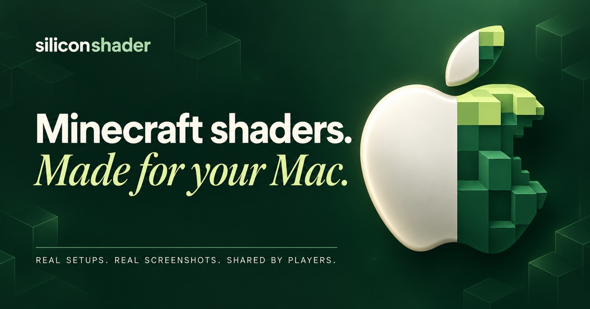

# Silicon Shader



Find and share Minecraft Java shader setups for Apple Silicon. Browse screenshots and measured results, then let your agent adapt a compatible recipe to your Mac, launcher and mods.

**[Browse setups](https://fortunexbt.github.io/minecraft-apple-silicon-framework/) · [Give your agent the prompt](agents/START.md) · [Share a setup](docs/CHALLENGE.md)**

## Get started

Give [the starter prompt](agents/START.md) to Codex, Claude Code or another coding agent with shell access. It detects your hardware and game, compares suitable recipes, and tries changes in a separate copy with rollback. Your current image quality is the starting point. Sharing is optional.

Prefer the CLI? You need **Python 3.10+** and your own Minecraft Java installation. There are no Python runtime dependencies or API keys.

```sh
git clone https://github.com/fortunexbt/minecraft-apple-silicon-framework.git
cd minecraft-apple-silicon-framework
python3 -m venv .venv
. .venv/bin/activate
python -m pip install .
silicon-shader discover
silicon-shader challenge find --this-mac
```

Continue with [try a setup](docs/WORKFLOW.md). Prism has the most direct integration; other launchers use an explicit game directory. The [agent skill](silicon_shader/skills/silicon-shader/SKILL.md) ships with the CLI and can also be read directly—installation into your agent is optional.

## Choose a setup that fits

New challenge submissions use [one shared seeded world and scripted flight](docs/WORKLOAD.md): two 21-second runs, targeting a repeat comparison under five minutes. Earlier-route recipes remain separate.

Each submission has a screenshot, Minecraft skin, hardware, game/mod versions, resolution, view distance, FPS/frame pacing and a reproducible recipe. Filter by Mac and compare the visual tradeoffs before choosing the highest FPS. There is no universal winner.

The first [M4 Wide View recipe](recipes/m4-wide24/README.md) includes its exact configuration, patches, route and observed limitations. The [hardware inventory](docs/HARDWARE.md) covers released Apple Silicon Macs; an inventory entry does not mean that machine has been benchmarked.

## What the toolkit does

| Task | Command or guide |
| --- | --- |
| Inspect the Mac, active player and game | `discover`, `doctor`, `runtime` |
| Find a community recipe | `challenge find --this-mac` |
| Try settings and roll back | `isolate`, `profile` — [workflow](docs/WORKFLOW.md) |
| Measure or tune several candidates | `capture`, `loop` — [benchmarking](docs/reference/BENCHMARKING.md) |
| Make a clean daily copy | `daily` |
| Preview and publish evidence | `challenge submit`, `challenge status` — [submission guide](docs/CHALLENGE.md) |

Configuration writes require an isolated managed copy. The CLI does not launch Minecraft, install arbitrary mods, or upload anything during tuning. External launchers retain control of Java and launch arguments. Unsupported settings need explicit adaptation.

Measurements use **CPU frame production**, not displayed or generated FPS. The optional sampler needs a confirmed hook for the Minecraft version. A copied setup is only gameplay-checked after a normal launch. [How to compare results](docs/FAIRNESS.md).

## Work on the project

- `silicon_shader/` — CLI, configuration adapters and bundled agent skill.
- `recipes/` — reproducible shared setups; `contributions/` — accepted measurement bundles.
- `site/` — static community library; `sampler/` — optional Java capture agent.
- `docs/` — player guides; `docs/reference/` — capture and submission contracts.
- `examples/`, `patches/`, `evidence/` — input templates, correctness fixes and historical research.

Read [AGENTS.md](AGENTS.md) before editing. Run `python3 -m unittest discover -s tests -v`; sampler changes also run `./sampler/smoke.sh`. Keep recipe/code improvements separate from evidence submissions. Preserve existing worlds and configurations.

The repository is the source of the website and accepted submissions. The index is generated, not edited by hand. Preview or host it anywhere:

```sh
python3 -m silicon_shader.registry contributions site/data.json
python3 -m http.server 8000 --directory site
```

No database or private backend is required. Historical campaign notes remain in [the experiment digest](docs/EXPERIMENTS.md) and `evidence/`.

Original code is [MIT licensed](LICENSE). See [third-party attribution](THIRD_PARTY.md) for mods, shaders and textures. Independent community project; not affiliated with Apple or Prism.

**NOT AN OFFICIAL MINECRAFT PRODUCT. NOT APPROVED BY OR ASSOCIATED WITH MOJANG OR MICROSOFT.**
