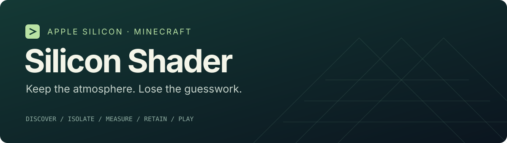

<p align="center"></p>

<p align="center"></p>

<p align="center"><strong>A small, open-source workbench for better Minecraft shaders on Apple Silicon.</strong><br>Discover → isolate → measure → keep the winner → play.</p>

Silicon Shader gives you a Python CLI, a short agent prompt, and an optional Java frame sampler. It helps you find a good visual/performance tradeoff in a handful of useful experiments, then leave the benchmark behind.

Settings and worlds stay in separate lab instances or game directories. Every configuration change has a rollback receipt. Install third-party components from their publishers; the repository distributes original tools, patch recipes and compact evidence.

### Start here

Requires **Python 3.10+** and your own Minecraft Java installation. [Prism Launcher](https://prismlauncher.org/download/) has the most direct setup path; other launchers can use an explicit game directory. No Python runtime dependencies.

**With an agent:** give it [this short prompt](agents/START.md). It handles setup and walks you through a few useful experiments.

**Manually:** install below, then follow the [workflow](docs/WORKFLOW.md). No agent or API key is required.

```sh
git clone https://github.com/fortunexbt/minecraft-apple-silicon-framework.git
cd minecraft-apple-silicon-framework
python3 -m venv .venv
. .venv/bin/activate
python -m pip install .
silicon-shader discover
```

To make a lab copy, close the source instance first:

```sh
silicon-shader isolate \
  "$HOME/Library/Application Support/PrismLauncher/instances/My Minecraft" \
  "$HOME/Library/Application Support/PrismLauncher/instances/Shader Lab" \
  --closed --save "My World"
```

Use the exact **save folder**, not its display name. Omit `--save` to create a fresh disposable world yourself. Existing instances are never overwritten; accounts, logs and launcher hooks are not copied.

### What you get

| Tool | Purpose |
| --- | --- |
| `discover` / `setup` / `runtime` | Inspect hardware, Prism, game version and Java needs; create new instance metadata |
| `isolate` | Copy only selected game/configuration content into a new lab |
| `profile` | Apply reversible settings; preserve the complete shader property set |
| `capture` | Request 20–30 seconds, inspect explicit status, reject partial or invalid output |
| `loop` | Validate a baseline, propose material changes, retain measured winners, stop |
| `daily` | Create a separate copy without Java agents, launch hooks or Minescript |

The search has **at most four trials by default** (hard limit six), stops after two failed improvements, and stops immediately when the baseline meets your chosen tradeoff. By default it keeps view distance at least 12 in its generated proposals and avoids scaling below 65%; choose stricter floors with the loop options. These are tuning guardrails, not hardware performance claims. Crispness and atmosphere still need your eyes.

### Evidence, without the hype

The reference campaign used a **base M4, 10 CPU/GPU cores, 24 GB**. Quality 75% used native 3024×1898 output, nearest scaling, R12/S8, MakeUp 9.5f and Faithful 32×. Short accepted scene captures averaged **84–119 CPU-produced frames/s**, including the limiter. The largest interval in that narrow set was **30.16 ms**. That is not GPU presentation, input latency, an all-day guarantee, or performance verified on another Mac.

Wide View 20 traded internal resolution for R20/S6. Brief ordinary movement showed approximately **91–105 F3 FPS**; a separate percentile readout was **69 FPS**. It was not locked at 120. The [experiment digest](docs/EXPERIMENTS.md) and [indexed ledger](evidence/) include losses, invalid runs, and unmeasured ideas as well as winners.

Discovery reads the actual Apple chip, CPU/GPU cores, RAM and Mac model, including M6 and A-series Macs. The [hardware reference](docs/HARDWARE.md) lists released configurations without rejecting newer chips. **Only the named M4 campaign has gameplay evidence.** Start from your own baseline on every other machine. Static scaling is the default; native Metal and dynamic resolution are research paths, not promised upgrades.


<sub>Historical 52.5% nearest-scale visual reference, not the final 75% benchmark. MakeUp Ultra Fast by [javiergcim](https://github.com/javiergcim/MakeUpUltraFast); textures by [Faithful](https://faithfulpack.net/).</sub>

### Scope and status

**0.2 early-access challenge.** The CLI is verified on disposable fixtures; the sampler has a synthetic Java smoke test. This repository build did not launch Minecraft or touch the source campaign’s instances. The live sampler hook is version-specific, must be explicitly configured, and has not been newly gameplay-qualified in this release. Unknown mappings fail closed.

- [Manual workflow and capture contract](docs/WORKFLOW.md)
- [Sampler build and hook setup](sampler/README.md)
- [Experiment digest](docs/EXPERIMENTS.md)
- [Attribution, licenses and download sources](THIRD_PARTY.md)
- [Correctness patch recipes](patches/)

Original framework code is [MIT licensed](LICENSE). Third-party components retain their own licenses. This project is independent of Apple, Prism and the mod/shader authors.

**NOT AN OFFICIAL MINECRAFT PRODUCT. NOT APPROVED BY OR ASSOCIATED WITH MOJANG OR MICROSOFT.**

## Open community challenge

**Find a setup for your Mac.** Browse gameplay screenshots, filter by chip and RAM, compare FPS alongside resolution and view distance, and ask your agent to try a compatible recipe. [How to compare setups](docs/FAIRNESS.md).

[Explore the hosted challenge](https://fortunexbt.github.io/minecraft-apple-silicon-framework/) · [Agent skill](silicon_shader/skills/silicon-shader/SKILL.md) · [Rules and optional submission](docs/CHALLENGE.md) · [What we learned from Yukon](docs/YUKON.md)

Version 0.2 adds launcher-neutral game-directory isolation, a read-only setup doctor, user-selected quality floors and an optional quality-first search. Community contributions pair a baseline and candidate, export bounded relative timing evidence, and use an explicit opt-in publication command. The site pairs screenshots with hardware, settings and measured results. No community measurements are fabricated to populate it.

```sh
silicon-shader doctor /path/to/game --game-dir
silicon-shader isolate /path/to/game /path/to/new-lab --game-dir --closed
silicon-shader challenge show
silicon-shader install-skill --destination ~/.agents/skills/silicon-shader
```

Generic game directories preserve the existing mod/shader stack. Automatic settings edits still require a supported adapter; launcher JVM arguments/hooks remain the operator's responsibility. Any harness can implement the documented [capture protocol](sampler/README.md), but missing focus/completion evidence cannot be invented.

### Ready to contribute?

This is an **early-access challenge**. You can submit matched experiments now; the sampler still needs an exact hook for your Minecraft version. Start with your existing setup and an agent, or use the manual workflow if you already have a compatible harness.

Publishing requires [GitHub CLI](https://cli.github.com/) and your GitHub login. Run `gh auth status --hostname github.com` to check it. [Submission instructions](docs/CHALLENGE.md#cli-and-hosted-board) cover preview, publication and retry. After submission, add enough setup and route detail to the PR for another player to repeat it. A maintainer reviews it before it appears on the board.

The Git repository is the durable source of the site and every accepted contribution. To rebuild the board elsewhere, run `python3 -m silicon_shader.registry contributions site/data.json`, then host `site/` on any static host. No database or private service is required.

### Find and try a shared setup

```sh
silicon-shader challenge find --this-mac --sort pacing
```

Your agent can read the matching recipes, compare versions and visual tradeoffs, then apply compatible settings through the existing isolated-lab and rollback workflow. It must not silently install unknown code, replace your mod stack or alter your original world.
