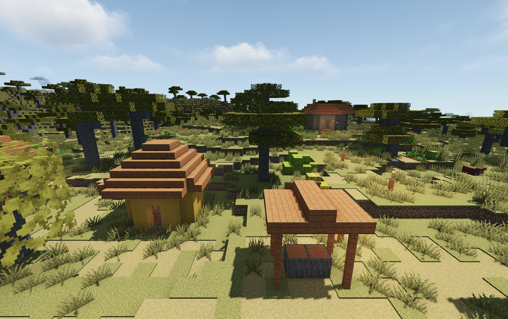

# What the campaign measured

This is historical research, not a queue of experiments to repeat. Start from the [published recipes](../recipes/m4-wide24/README.md) and current [shared workload](WORKLOAD.md).

## Decisions the next agent should inherit

- Preserve the version-matched Iris depth-identity and MakeUp exposure/finite-CAS correctness fixes. A black or corrupted world is invalid, however high its FPS.
- Use static render scaling as the measured default. Dynamic scaling and alternate Metal renderers were not established as better daily replacements.
- Shader scale, scaler filtering and anisotropic texture filtering are different controls. Preserve full shader properties when changing one value.
- Spend headroom according to the player’s preference: clarity, reflections or farther terrain may be worth a small FPS cost. Start from their current quality floor.
- Do not repeat JVM matrices, tiny AO differences or already rejected presets without a new material reason. Try one meaningful change and stop.
- Prepared terrain and the fixed flight make comparisons useful; screenshots and raw FPS alone do not prove a win. Keep all slow frames.
- A short smooth flight does not rule out inventory or gameplay hitches. The accepted Wide View daily had a 76 ms first-inventory observation.
- Keep the accepted fallback. A copied or newly configured daily instance is not automatically gameplay-verified.

### Added from the peak search

These come from 133 captures over 78 launches on the base M4 with Minecraft 26.3, Fabric 0.19.5, Sodium 0.9.2 and Iris 1.11.6. They are scoped to that machine and stack.

- **Judge a run by its picture.** FPS pinned at the cap with a vanilla looking frame means shaders did not run. A leftover `preferredGraphicsBackend:"vulkan"` made Iris draw nothing and produced two invalid pairs. Set the backend to `opengl` explicitly for every Iris run, and read the portrait or a route screenshot before trusting a number.
- **Discard the first flight of each launch.** In 46 of 54 two flight launches the second flight was faster by 2.35 FPS on average, and its 1% low was 65.5 against 52.4 FPS. The worst frame was 21 against 39 ms. Run three flights, discard the first, and report the same later flight for both sides. Noise falls to about 1 FPS. With two reps including the first, differences under about 5 FPS are not real.
- **Use borderless fullscreen.** `exclusiveFullscreen:false` measured about 4% faster (wide view 107.2 and 108.9 FPS against 103.1 and 103.7). Part of that is 3% fewer shaded pixels, since borderless renders 3024x1898 below the notch. Name the mode in the recipe, because the public schema cannot record it.
- **Render scale is the master knob.** The frame time model fits nine MakeUp points to about 1 FPS.

  `frame_ms = terrain(render distance) + 11.3 ms x scale^2 + effects`

  Terrain costs 3.9 ms at 12 chunks, 6.2 at 24, 6.6 at 28 and 7.75 at 32. The 11.3 ms is about 1.9 ms per shaded megapixel at this output size. Effects at about 55% scale cost 0.3 ms for reflections, 0.3 ms for V_CLOUDS 2, 0.9 ms for bloom, 1.6 ms for bloom plus gloss and 3.8 ms for volumetric light 2. Filtered shadows, 5 step AO and anisotropic filtering were within noise. Sildur's Lite has about 1.6 times MakeUp's per pixel cost and about 2.5 times its geometry term, because its shadow and gbuffer passes redraw terrain (a three point fit, least certain).
- **At long view distance shaders cannot help.** At 32 chunks terrain is about 70% of the frame, so lean shader settings bought nothing (90.4, 85.9 and 86.0 FPS at 55, 60 and 65% against the control). Each extra 10% of scale cost about 10 FPS. Spend headroom on scale or distance, not on shader trimming.
- **Define "stable 90".** Worst five second FPS ran about 0.92 times the average in every configuration, so "stable 90" means an uncapped average of at least about 98 FPS. Then cap at 90 for play, which gave the smoothest pacing measured (jitter 0.4 to 0.6 ms). Measure uncapped at 120. VSync gave no pacing gain.
- **Predicted maximum scale for stable 90** (model, not all points tested).

  | Setup | R16 | R20 | R24 | R28 | R32 |
  | --- | --- | --- | --- | --- | --- |
  | MakeUp, reflections, V_CLOUDS 2 | 0.67 | 0.62 | 0.55 | 0.52 | 0.41 |
  | Sildur's Lite (least certain) | 0.60 | 0.51 | 0.37 | n/a | n/a |

  The 0.41 for MakeUp at 32 chunks is below the public floor of 0.5. Measured, 0.50 gave 97.1 and 98.4 FPS with a worst five seconds of 88.6 and 89.8.
- **The public floor is scale 0.5.** The schema accepts 0.5 to 1.0. A 0.45 Distant Horizons result (about 100 FPS) was measured and could not be submitted. Plan candidates at 0.5 or above.
- **Pack results at 32 chunks and 55% scale** (one rep, about 2 FPS low). Iris/OpenGL unless noted.

  | Pack | FPS | Verdict |
  | --- | --- | --- |
  | MakeUp Ultra Fast 9.5f, patched | 84 to 86 | Best FPS per unit of quality. The only pack holding 80 or more at 32 chunks. Muted and realistic. |
  | Miniature 2.19 | 102.0 | Bright, vivid reflections, flat lighting. Worth a look for depth options. |
  | Sildur's Vibrant 2.02 Lite | 58 to 62 | Most striking image. Overexposes entities and washes out the player skin. Medium is slower (54.2) with the same look. |
  | Super Duper Vanilla 1.3.8 | 67.1 | Pink noon tint and a dark blue player. Broken. |
  | Complementary 5.9.3 (R12, 75%) | 49 to 77 | Too slow. |
  | Photon Mac (Low, 50 to 65%) | 29 to 32 | Best clouds and haze. Unplayable. |
  | E-LITE 5.1.2 | none | Dies during compile on macOS GL 4.1. Works under Vitrail at 61. |
  | Iris 1.11.7 with MakeUp 9.5g | 74.0 against 85.8 | Regression. Stay on Iris 1.11.6 and MakeUp 9.5f. |

  Sildur's tuning did not help. 2D clouds, no godrays, or both stayed within noise of 61.0. 45% scale gave 65.4 and 24 chunks gave 75.1. Its cost is geometry at long view distance, not sky effects. At 16 chunks and 60% it holds a worst five seconds above 90 (99.8 and 100.1 FPS, 90.3 and 90.6). At 18 chunks it falls to about 86.
- **Distant Horizons is a distance lever on Iris/OpenGL.** Stand still for about 200 seconds so LODs generate (LODs were not kept across the harness world restore). Its cost lives in `horizontalQuality`, `maxHorizontalResolution` and vertical `HEIGHT_MAP`, each saving about 8 FPS and roughly additive. Fade mode, SSAO, anti aliasing and `verticalQuality LOW` changed nothing. With Sildur's Lite at 50% scale and radius 256, defaults gave 83 to 85 FPS, adding `FOUR_BLOCKS` gave 90 to 92, adding `LOW` horizontal quality gave 92 to 93 with a nearly identical picture, and `LOW` plus `FOUR_BLOCKS` at 10 real chunks gave 98 to 100 (the published Far Horizon). `HEIGHT_MAP` flattens cliffs into olive columns and is not worth it. About six GL render pass error lines print during the first seconds of loading and none appear in flight.
- **Distant Horizons on Vulkan costs about 30 FPS.** With Vitrail on 26.3's Vulkan backend at 16 chunks and 50% scale, MakeUp gave 43.6, E-LITE 44.9 and Sildur's 47.3 FPS. MetalFX lifted Sildur's to 56.0 and MakeUp to 52.2. On Iris/OpenGL the same feature is nearly free.
- **Vitrail cost is per pack and per pass, not per pixel.** On MakeUp at 32 chunks, scale 0.5, 0.75 and 1.0 gave 64.1, 61.5 and 62.7 FPS. Switching the pass chain off gave 119.2 (the cap), and cutting it to the first 1, 2, 3, 4 passes gave 95.7, 75.8, 68.1 and 68.4. The first two passes (prepare and deferred) carry most of the cost, and the render thread spent 60% of a sample parked waiting. Light packs run well (Miniature 112.7) and heavy ones do not (Photon 28.4, Solas 20.5, Reverie 19.4). Vitrail is not faster than Iris for any pack Iris can already run (MakeUp 64 against 98, Sildur's 50 against 58 to 62 at 32 chunks). Use it only for packs Iris cannot draw.
- **Minecraft's own Vulkan renderer is faster, but Iris cannot use it.** Shaderless at 32 chunks, uncapped, it measured 240 to 243 FPS against 156 to 168 on OpenGL (4.1 against 6.0 ms). About 1.9 ms of the 32 chunk geometry cost is the OpenGL to Metal translation. A cap of 120 hides this entirely, so always uncap such tests.
- **The shipped showcase script can hang the game on macOS.** The render thread blocks in native `SDL_PollEvent` after the script leaves fullscreen and resizes the window. It is timing dependent, heavier frames (DH, MetalFX) make it likelier, and it happened three times. Take the portrait in a separate short launch started in a 1920x1080 pixel window (960x540 logical on Retina) with the same shader and settings, and no timed flights.
- **Inspect the portrait yourself before publishing.** A data only submission merges automatically at the checked commit and goes live, and the checks do not certify the image. Recipe and tool PRs get normal review, and a card can link to a recipe that has not been reviewed yet.

### Do not repeat

These were tried and rejected on this Mac and stack. Revisit only with a new material reason.

- JVM flag matrices, heap pre touch, three chunk threads, compact object headers (within noise).
- Shadow quality 3, VSync, the 90 cap as a speed trick (it is for pacing), water texture (block grid pattern), blocky clouds (toy like), 16 step clouds.
- Bloom, material gloss and volumetric light 2 (up to 21 FPS for no visible gain). Screen space reflections at long distance are the exception, since they cost only about 2.6 FPS at 32 chunks and 55% scale and improve water.
- Scales of 85% and above, and scale below 0.5 for anything intended for publication.
- Complementary, Photon, Solas and Reverie as Iris daily packs, Super Duper Vanilla 1.3.8, E-LITE on Iris, Sildur's Medium, and Iris 1.11.7 with MakeUp 9.5g.
- Sildur's sky options, DH fade mode, DH SSAO and anti aliasing, `verticalQuality LOW` as speed levers.
- Lean shader variants at 32 chunks (geometry bound).
- Vitrail resolution scaling as a performance lever. Photon Mac under Vitrail (needs the original Photon, composite14 fails to compile and the frame is vanilla).
- Voxy on 26.3 (upstream jar needs GL 4.6 and disables itself on macOS, and the Metal ports exist only for 1.21.11).
- Zink with KosmicKrisp or MoltenVK for GL 4.6 (about 4 times slower, broken on 26.3 SDL3).
- mcopt as a drop in (native Metal, no Iris or shader packs, needs Sodium 0.9.3 exactly and macOS 26, forces OpenGL when DH is present). Its FPS is vanilla at 1080p against its own earlier builds.
- Comparing results pinned at a 120 FPS cap. Uncap first.
- Reporting a first flight, or a one flight run, as evidence.

### Open questions

- Gameplay checks (inventory, block interaction, save and reload) have not been done for Vibrant 16, Max 32 or Far Horizon, so none is a verified daily profile.
- Sildur's skin and entity exposure. `Contrast 1.8` and `eyeLight 2.0` variants were defined and not tested.
- Whether LODs persist between normal launches, and Distant Horizons on a Vulkan native pack path.
- MetalFX temporal at 0.5 with Vitrail looked slightly better than Vitrail's own upscale (68.8 against 64.1), from one flight.
- A harness that switches shader, scale and distance in session (Iris reload and `renderDistance().set`) to remove first flight bias and cut each variant from about 147 to about 60 seconds. Confirm any winner with fresh launches.
- Miniature at 32 chunks with tuned shadow options for depth.

## Original quality campaign

These receipts describe one base M4 MacBook Pro (10 CPU cores, 10 GPU cores, 24 GiB memory). They do not forecast performance on another Mac. The indexed values and source references live in [`evidence/ledger.json`](../evidence/ledger.json).

The selected M4 profile used Minecraft 26.3 with Fabric Loader 0.19.5, Iris 1.11.6, Sodium 0.9.2, MakeUp Ultra Fast 9.5f, and Faithful 32x. It ran at native 3024×1898 fullscreen output, 75% internal scale with nearest filtering, render distance 12, simulation distance 8, 10-sample volumetric clouds, a 120 FPS cap, VSync off, and ARM64 Java 25/G1 with a 512 MiB initial and 4 GiB maximum heap. The clean campaign copy had no benchmark Java agent or Minescript.

Short CPU frame-production captures measured 92.3 FPS on loaded travel, 88.3 on fresh travel, 84.4 over ocean, 94.9 at a village with entities, 114.9 in open Nether, and 119.4 in the End. The longest interval in those finalist captures was 30.16 ms; none exceeded 33, 50, or 100 ms. A few isolated 23–30 ms intervals stood out against nearby frame times. These samples include the limiter and do not measure GPU presentation or input latency. The 120 FPS value is a cap, not a locked rate or a zero-hitch guarantee.

At 65% internal scale, the same short loaded and fresh travel checks measured 105.6 and 100.2 FPS. That gives more headroom with a softer image. The campaign kept 75% as its quality choice. A separate 20-chunk profile at 60% scale had only a brief ordinary-movement check (91 and 105 FPS snapshots); the handoff also recorded a 69 FPS percentile readout. It has no controlled-route or sustained qualification.

A previous 16-chunk profile showed more distant terrain than R12 and cost roughly 13% in uncapped dense-jungle throughput. It passed a 15-minute 60-cap village run at 59.93 FPS average, with one interval above 33 ms. That is a supported tradeoff, not the current 75% daily profile.

The first shader screens favored MakeUp Ultra Fast for this M4 workload. They are not visual-quality-normalized comparisons: presets and internal resolution differed. Complementary, BSL, Bliss, and Sildur's were examined. Faithful 32x looked at least as fast as default textures in two small screens, but the difference was too small to call causal. Java 25 G1 stayed in the profile because ZGC did not show a repeatable benefit.

Several ideas did not earn promotion. Removing cloud work was slightly slower in matched samples. Turning off cloud reflections raised one sample by about 4% but removed atmosphere. An 80% scale candidate measured below the 75% controls in its matched ocean and travel samples. The first dynamic-scale prototype produced a dark daylight frame during resize; an exposure-history guard repaired that reset in short checks, but the adaptive system still lacked an in-route scale trace and a preferred image result. Static scaling remains the measured choice.

Metal-renderer probes did not replace the chosen shader stack. Complemetal left Iris/OpenGL as the visible renderer when a shader pack was active. Prisma's preview hotfix reached 18.3 CPU FPS in its short native-output village screen. Rockstar Shaders rendered correctly but measured 24.7 FPS at its tested High/native scale and 25.6 FPS at Medium/0.58 scale. Solas produced no valid performance result under the tested gates. Distant Horizons later produced valid results, summarised below.

## Visual sample

This inspected screenshot has no debug overlay, world coordinates, username, run label, or visible menus. It is a 52.5% comparison capture using MakeUp Ultra Fast and Faithful 32x, not a final-profile benchmark. See [the image note](../evidence/images/README.md), [component credits and licenses](../THIRD_PARTY.md), and the Mojang disclaimer in the main README.

## How to read the records

The ledger indexes 391 campaign frame-summary JSON files. It retains scene-level results and decision notes rather than raw frame CSVs, unrelated log files, shader archives, worlds, or runtimes. `intervals_gt_ms` are counts. `sum_of_complete_intervals_gt_ms` is the sum of whole intervals over a threshold, not excess time above it. Abrupt local outliers are separate from fixed thresholds. Invalid captures, incomplete runs, and unmeasured hypotheses are labeled so they cannot be mistaken for wins.
