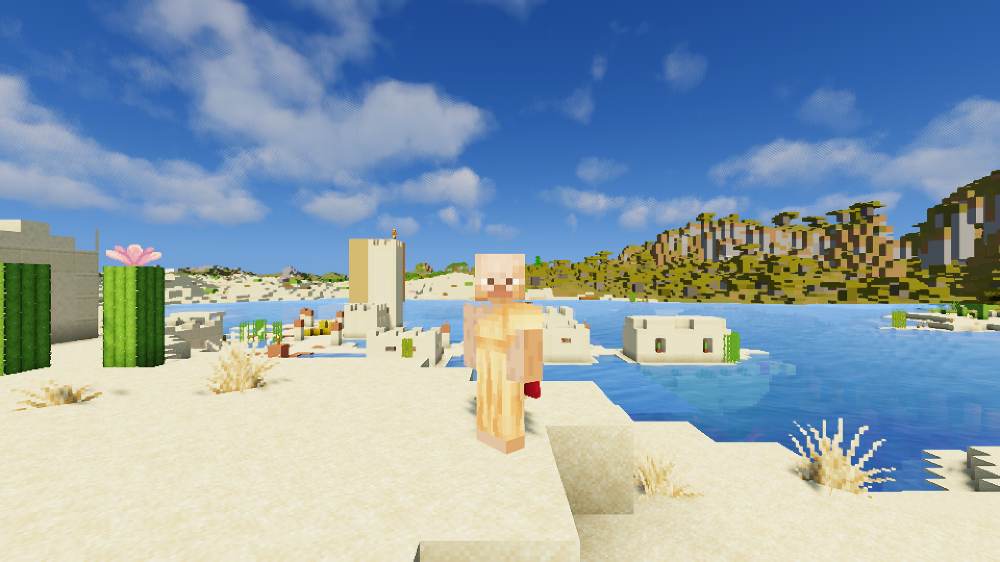
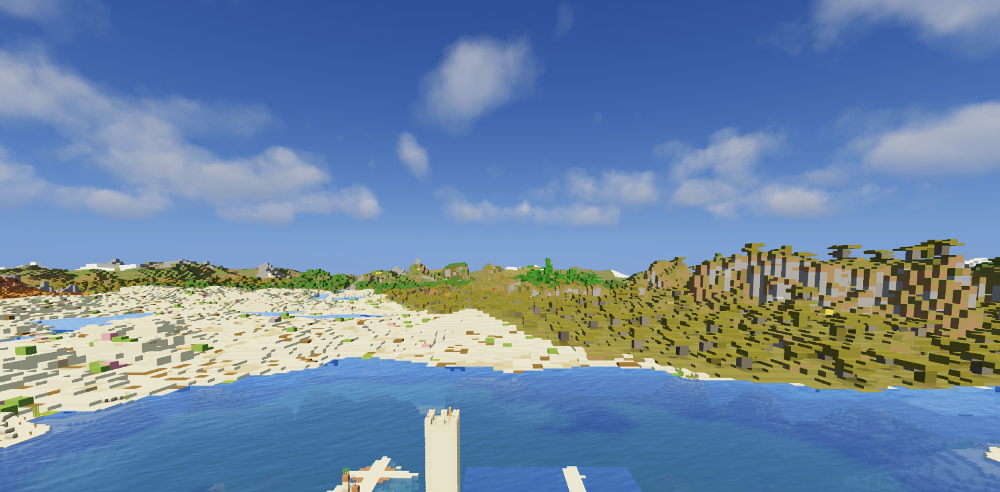

# M4 Far Horizon

Sildur's Vibrant shaders with terrain out to the horizon at a stable 90 on a base M4 MacBook Pro (10 CPU cores, 10 GPU cores, 24 GiB). Real chunks stay close (10) and [Distant Horizons](https://modrinth.com/mod/distanthorizons) draws shaded level-of-detail terrain out to 256 chunks, beyond Minecraft's 32-chunk maximum. It starts from the [M4 wide-view recipe](../m4-wide24/README.md) and keeps its Minecraft 26.3, Fabric 0.19.5, mod list, Iris depth-identity fix, RenderScale build, Faithful 32x textures, Java 25 runtime and 4 GiB heap. It changes the shader pack, adds one mod and changes four settings.

## Changes from M4 wide-view

| Setting | Wide view | Far Horizon |
| --- | --- | --- |
| Shader pack | MakeUp Ultra Fast 9.5f (patched) | Sildur's Vibrant Shaders 2.02 Lite, pack defaults |
| Added mod | none | Distant Horizons 3.3.4 for 26.3 |
| Render distance | 24 | 10 |
| RenderScale `scale` and `irisScale` | 0.6 | 0.5 |
| Distant Horizons LOD radius | not installed | 256 chunks |
| Distant Horizons `horizontalQuality` | not installed | `LOW` |
| Distant Horizons `maxHorizontalResolution` | not installed | `FOUR_BLOCKS` |

Every other Distant Horizons option is at its default. Everything else is unchanged, including simulation distance 6, nearest filtering, 8x anisotropic filtering and the 120 FPS cap used for measurement (a 90 cap gave the smoothest pacing in earlier runs). Both captures in the pair ran in borderless fullscreen (`exclusiveFullscreen:false`).

Download Sildur's Vibrant Shaders v2.02 Lite from its official Modrinth page, version `cianYi38`: https://modrinth.com/shader/sildurs-vibrant-shaders/version/cianYi38 (All Rights Reserved; nothing is redistributed or patched). Download Distant Horizons 3.3.4 for 26.3 (Fabric) from Modrinth. Neither jar nor pack is included here.

Before measuring or playing, stand still near the spot for about 200 seconds so Distant Horizons can generate the surrounding level-of-detail terrain. The measurement flight starts after that.

## Measurements

One same-machine pair on the standard 420-tick Overworld flight-and-turn route at 3024x1898 output, both in borderless fullscreen, cap 120. Each capture is the third flight of its launch; the first flight of every launch was a warm-up and ran a few FPS slower with deeper 1% lows. The candidate launch stood still for 200 seconds before its flights so Distant Horizons could generate level-of-detail terrain.

| | Wide view (R24, MakeUp, 60%) | Far Horizon (R10 + LOD 256, Sildur's, 50%) |
| --- | --- | --- |
| Average | 108.97 FPS | 98.35 FPS |
| Worst five seconds | 100.79 FPS | 92.81 FPS |
| p99 frame | 11.35 ms | 13.81 ms |
| Longest frame | 13.75 ms | 19.66 ms |
| Frames over 33 ms | 0 | 0 |

The other warmed flights of the same candidate launch measured 98.9 FPS (worst five seconds 92.2) and the warm-up flight 100.9 (91.9). Two earlier launches of the same setup measured 100.4 and 98.5 FPS (worst five seconds 91.7 and 92.2). Run-to-run noise on this Mac is about 1 to 3 FPS.

Standard front-facing portrait (taken in a separate windowed launch, see Limits). It looks toward the cliffs where real chunks hand over to level-of-detail terrain, so it shows that boundary more than the horizon:

Lab vista from the same setup (not the standard portrait): the view from above the village toward the whole horizon, shaded by the pack out to the 256-chunk LOD limit. The four-block LOD cells show as chunkiness on the right-hand hills.

These are short CPU frame-production measurements on the shared route. They are not displayed FPS, input latency or a long-session guarantee.

## What was measured to get here

Each row is one change on top of the previous Distant Horizons setup (Sildur's Lite, 12 real chunks, 50% scale, LOD radius 256, defaults), warmed flights on the same route and machine.

| Change | FPS | Worst five seconds | Picture |
| --- | --- | --- | --- |
| defaults | 83 to 85 | 77 | full-quality LOD |
| fade mode off, SSAO off, anti-aliasing off, vertical quality LOW | 83 to 85 | 76 to 78 | no change |
| `maxHorizontalResolution FOUR_BLOCKS` | 90 to 92 | 83 to 84 | chunkier cliffs |
| `horizontalQuality LOW` | 92 to 93 | 84 to 85 | almost identical |
| `verticalQuality HEIGHT_MAP` | 93 | 84 to 86 | cliffs flatten to flat columns |
| LOW + `FOUR_BLOCKS` | 95 to 97 | 89 to 90 | chunkier cliffs |
| LOW + `FOUR_BLOCKS`, 10 real chunks | 98 to 100 | 92 | used here |
| Sildur's shadow samples 2, shadow distance 50 | no change | | |
| LOW + HEIGHT_MAP + `FOUR_BLOCKS`, 12 chunks | 101 to 103 | 93 to 94 | flat olive blocks, not used |

Sildur's own sky options (clouds, godrays) and shadow settings measured within noise. The cost sits in the Distant Horizons LOD quality and in the real-chunk count.

## Limits

- Real chunks reach only 10 (about 160 blocks); beyond that, level-of-detail terrain has flat colours, no entities and chunkier shapes. Cliff faces are blockier than the full-quality setting.
- Player skins render brighter than with MakeUp.
- Distant Horizons printed a few OpenGL render-pass errors in the first seconds of loading under Iris; none appeared during flights. Treat it as beta behaviour.
- The standard portrait step of the shipped `showcase.pyj` hung the game on this stack (it stalls in a macOS window event call when leaving fullscreen). The portrait here was taken in a separate short launch, started in a 1920x1080 window with the same shader and setting values, with no timed flights.
- Not qualified as a daily profile. Inventory, block interaction and save/reload were not checked. Try it in your own worlds first.

## Rollback

Remove Distant Horizons, select your previous shader pack, and restore render distance 24, RenderScale `scale`/`irisScale` 0.6, or keep using your accepted daily instance as fallback.
