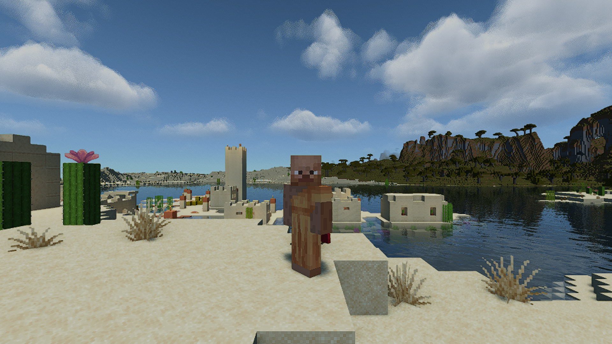

# M4 Max 32

Minecraft's maximum render distance of 32 chunks with MakeUp Ultra Fast, on a base M4 MacBook Pro (10 CPU cores, 10 GPU cores, 24 GiB). It starts from the [M4 wide-view recipe](../m4-wide24/README.md) and keeps its Minecraft 26.3, Fabric 0.19.5, mod list, Iris depth-identity fix, MakeUp 9.5f exposure and finite-CAS patches, RenderScale build, Faithful 32x textures, Java 25 runtime and 4 GiB heap. It changes five settings.

## Changes from M4 wide-view

| Setting | Wide view | Max 32 |
| --- | --- | --- |
| Render distance | 24 | 32 |
| RenderScale `scale` and `irisScale` | 0.6 | 0.5 |
| MakeUp `REFLECTION_SLIDER` | 1 | 2 |
| MakeUp `AOSTEPS` | 2 | 5 |
| MakeUp `V_CLOUDS` | 1 | 2 (softer, fuller volumetric clouds) |

Every other setting is unchanged, including simulation distance 6, nearest filtering, 8x anisotropic filtering, filtered shadows with `SHADOW_DISTANCE_SLIDER 0`, and the 120 FPS cap used for measurement (a 90 cap gave the smoothest pacing in earlier runs). Both captures in the pair ran in borderless fullscreen (`exclusiveFullscreen:false`), which measured about 4% faster than exclusive fullscreen on this Mac.

## Measurements

One same-machine pair on the standard 420-tick Overworld flight-and-turn route at 3024x1898 output. Each capture is the third flight of its launch; the first flight of every launch was a warm-up and ran a few FPS slower with deeper 1% lows.

| | Wide view settings (R24, 60%, borderless) | Max 32 (R32, 50%, borderless) |
| --- | --- | --- |
| Average | 109.15 FPS | 98.49 FPS |
| Worst five seconds | 101.37 FPS | 88.91 FPS |
| p99 frame | 11.88 ms | 12.46 ms |
| Longest frame | 17.84 ms | 16.74 ms |
| Frames over 33 ms | 0 | 0 |

The other warmed flights of the same two launches measured 108.3 FPS (worst five seconds 100.1) for wide view and 96.9 FPS (88.6) for Max 32. An earlier launch of Max 32 measured 97.1 and 98.4 FPS (88.6 and 89.8). Run-to-run noise on this Mac is about 1 to 3 FPS. The worst five-second rate sits just under 90 FPS rather than above it.

Both captures ran in borderless fullscreen. The published M4 Wide View card used exclusive fullscreen, so its numbers are not directly comparable with the baseline column here.

These are short CPU frame-production measurements on the shared route. They are not displayed FPS, input latency or a long-session guarantee.

## What this costs

Across this campaign's matched runs, frame time followed `terrain cost(render distance) + 11.3 ms x scale^2 + effects`, with the terrain term at 3.9 ms for 12 chunks, 6.2 for 24 and 7.75 for 32. At 32 chunks terrain is about 70% of the frame, so shader tuning buys little; the render scale buys the headroom. At 55% scale the same settings averaged about 91 FPS (worst five seconds 83). Reflections cost about 0.3 to 0.6 ms, V_CLOUDS 2 about 0.3 ms, and 5-step AO, filtered shadows and anisotropic filtering were within noise. Bloom, material gloss, volumetric light 2 and a longer shadow distance each cost more and were left off.

## Other 32-chunk results on this Mac

These did not become the recipe but may save you time. All used the same route and machine, 32 chunks unless noted.

- Sildur's Vibrant Lite under Iris: 58 to 62 FPS at 60% scale. It reached a stable 90 only at 16 chunks.
- Sildur's Vibrant Lite with Distant Horizons 3.3.4 (16 real chunks plus LOD out to 128 to 256 chunks) at 50% scale: 77 to 82 FPS. The far terrain renders with shaders, with a few render-pass errors logged during loading.
- Minecraft's own Vulkan renderer (via MoltenVK), with no shaders and the cap lifted: 242 FPS against 167 FPS on OpenGL. Iris cannot run on Vulkan. Vitrail 0.12.0-beta runs packs on it, but measured slower here: Sildur's Lite 50 FPS, Complementary 31 FPS.
- A shaderless FPS reading pinned at the frame cap says nothing about shaders. Check the screenshot.

## Limits

- Wide view shows less distant terrain. Max 32 trades resolution (50% internal scale, nearest filtering) for distance and has a softer image.
- Not qualified as a daily profile. Inventory, block interaction and save/reload were not checked. Try it in your own worlds first.
- The original MakeUp pack and fixes are the wide-view recipe's. This recipe changes only options.

## Rollback

Restore render distance 24, RenderScale `scale`/`irisScale` 0.6, `REFLECTION_SLIDER=1`, `AOSTEPS=2` and `V_CLOUDS=1`, or keep using your accepted daily instance as fallback.
