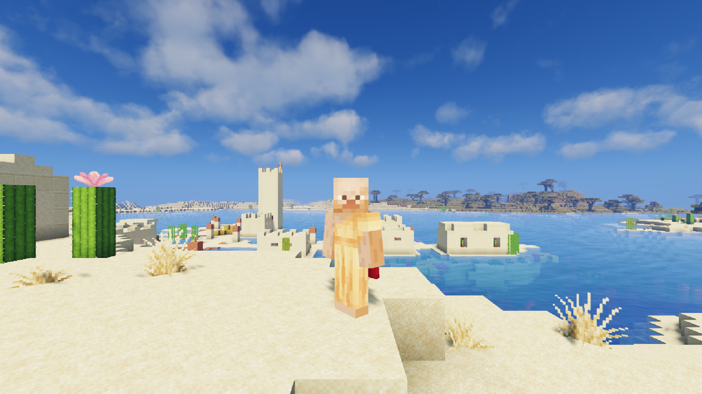

# M4 Vibrant 16

A stable-90 Sildur's Vibrant setup for a base M4 MacBook Pro (10 CPU cores, 10 GPU cores, 24 GiB). It starts from the [M4 wide-view recipe](../m4-wide24/README.md) and keeps its Minecraft 26.3, Fabric 0.19.5, mod list, Iris depth-identity fix, RenderScale build, Faithful 32x textures, Java 25 runtime and 4 GiB heap. It changes the shader pack, render distance and window mode. The internal render scale stays at 0.6.

## Changes from M4 wide-view

| Setting | Wide view | Vibrant 16 |
| --- | --- | --- |
| Shader pack | MakeUp Ultra Fast 9.5f (patched) | Sildur's Vibrant Shaders 2.02 Lite |
| Shader options | recipe overrides | pack defaults |
| RenderScale `scale` and `irisScale` | 0.6 | 0.6 |
| Render distance | 24 | 16 |
| Simulation distance | 6 | 6 |
| Frame cap | 120 | 120 for measurement; 90 recommended for play |
| Window | exclusive fullscreen | borderless fullscreen (`exclusiveFullscreen:false`) |

Download Sildur's Vibrant Shaders v2.02 Lite from its official Modrinth page, version `cianYi38`: https://modrinth.com/shader/sildurs-vibrant-shaders/version/cianYi38. The pack is All Rights Reserved; this recipe does not redistribute or patch it. Place the zip in `shaderpacks/` and select it in Iris. Keep its options at their defaults (delete any old `Sildurs Vibrant ... Lite.zip.txt` beside it).

The MakeUp exposure and sharpening patches do not apply to this pack. The Iris depth-identity fix still matters for scaled shader output.

## Measurements

One same-machine pair on the standard 420-tick Overworld flight-and-turn route, both in borderless fullscreen at 3024x1898 output, cap 120, each the warmed second flight of its launch:

| | Wide view settings (R24, MakeUp, 60%, borderless) | Vibrant 16 (R16, Sildur's Lite, 60%, borderless) |
| --- | --- | --- |
| Average | 107.23 FPS | 99.82 FPS |
| Worst five seconds | 98.96 FPS | 90.33 FPS |
| p99 frame | 11.91 ms | 12.53 ms |
| Longest frame | 20.66 ms | 22.61 ms |
| Frames over 33 ms | 0 | 0 |

The baseline and candidate columns are each the second flight of their launch. The third warmed flight of the candidate launch measured 100.1 FPS with a worst five-second rate of 90.6 FPS. A repeat launch with Sildur's `Brightness=0.8` measured 99.2 and 99.2 FPS (worst five seconds 89.9 and 90.0).

These are short CPU frame-production measurements on the shared route. They are not displayed FPS, input latency or a long-session guarantee.

## Why these choices

- Borderless fullscreen measured about 4% faster than exclusive fullscreen at native output on this Mac. The wide-view baseline went from 103 to 108 FPS after warm-up. Borderless renders 3024x1898, below the notch, so it also shades about 3% fewer pixels.
- Sildur's Vibrant costs about 1.6x MakeUp per shaded pixel and about 2.5x per chunk of view distance on this route, because its shadow and gbuffer passes redraw terrain. Its sky options (volumetric or 2D clouds, godrays) were within noise. Render distance is the setting that decides whether it holds 90.
- At 16 chunks and 60% scale it held a worst five-second rate above 90 FPS. At 18 chunks it fell to about 86.
- Brightness 0.8 changed neither the look nor the pacing measurably.

## Limits

- 16 chunks shows less distant terrain than the wide-view recipe. From the fixed showcase spot, the far savanna cliffs are cut off.
- Player skins render brighter than with MakeUp.
- The first flight after launch ran a few FPS slower with deeper 1% lows. Comparisons used warmed flights.
- Not qualified as a daily profile. Inventory, block interaction and save/reload were not checked. Try it in your own worlds first.

## Rollback

Select your previous shader pack in Iris, restore RenderScale `scale`/`irisScale`, render distance and `exclusiveFullscreen:true` from your saved profile, or keep using the accepted daily instance as fallback.
