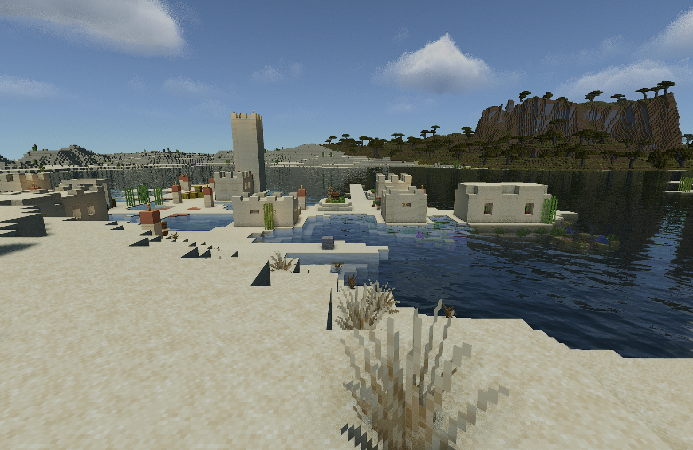

# Base M4: wide-view MakeUp shaders

A configuration showcase selected from the campaign's shader, renderer, scaling, JVM and settings experiments. It prioritizes atmosphere and a longer horizon over the largest counter. It is self-reported and has not been independently reproduced.

The October 3 paired camera segment produced 96.52 FPS at 22 chunks without texture filtering and 94.28 FPS at 24 chunks with 8x anisotropic texture filtering. Worst five-second rates were 94.92 and 92.74 FPS. Maximum intervals were 14.76 and 14.89 ms, with no recorded intervals above 33, 50 or 100 ms and no detected local abrupt outliers. These are CPU frame-production intervals, including the limiter, from one approximately 21-second pair. They do not measure presentation or input latency, qualify travel across all worlds, promise locked 120 FPS, or establish a statistical speed difference. Short-run tail statistics should not be treated as qualified long-session tails.

Both presets keep native 3024x1964 exclusive fullscreen output, a static 60% internal scale, nearest scaler filtering, 120 FPS cap, VSync off, simulation distance 6, two Sodium workers, Faithful 32x, volumetric clouds, TAA, filtered shadows and the complete MakeUp atmosphere. The baseline and candidate differ only in render distance and anisotropic texture filtering. The wider view costs about 2.3% average frame production in this pair. Texture filtering is enabled for shallow-angle texture detail; this is an operator preference, not an objective beauty score.

The 75% quality profile and clean low-cost fallback remain alternatives in the campaign ledger. The wide preset was chosen for the user's preference for distance with preserved current resolution. The screened Metal renderers, shader-work variants and JVM alternatives did not establish a better supported overall balance. A later AO work-elimination experiment compiled and looked sound but its single roughly 2% gain was not retained; it is absent from this recipe.



Actual unedited gameplay from the clean 24-chunk daily copy, at native output and the same shader/scaling settings. The screenshot is a nearby village-water view; the paired timing route is the fixed camera position described below. It is illustrative, not a timing measurement. Faithful textures: [Faithful team](https://faithfulpack.net/). MakeUp shaders: KDXavier.

## Recreate the setup

Use an isolated Prism instance. Download your own Minecraft Java 26.3 and Fabric Loader 0.19.5. The measured launcher was Prism 11.1.1 on a base M4 with 10 CPU cores, 10 GPU cores and 24 GiB RAM, running macOS 26.7.1 and Microsoft ARM64 Java 25.0.4.1. The machine was on AC power with low-power mode off. Stock G1, 512 MiB initial and 4096 MiB maximum heap were used.

[setup.json](setup.json) lists the exact installed mod versions, public visual settings and the declared A/B interventions. Obtain mods from their [original project pages](../../THIRD_PARTY.md). The additional recipe components are [RenderScale 1.4.0-alpha.6 for Fabric 26.3](https://modrinth.com/mod/renderscale/version/Qr4y3YLK) and [More Culling 1.9.0-beta.1](https://modrinth.com/mod/moreculling). Do not substitute a newer release and call it the same experiment.

Obtain [MakeUp Ultra Fast 9.5f](https://modrinth.com/shader/makeup-ultra-fast-shaders/version/IUFkxmHz) and [Faithful 32x for 26.3](https://modrinth.com/resourcepack/faithful-32x/version/lDYpMiqk). Faithful textures are by the [Faithful team](https://faithfulpack.net/); MakeUp is by KDXavier/Javier Garduno. No third-party archive, game file, runtime or world is distributed here.

Apply the [existing Iris depth-identity v3 recipe](../../patches/README.md#iris-depth-identity-v3) to the pinned Iris 1.11.6 upstream artifact. Preserve the original. It fixes the stale depth-texture identity guard; it is not a marketed frame-rate optimization.

Create a separate MakeUp ZIP with exposure-history initialization and finite nine-tap CAS:

```sh
python3 recipes/m4-wide24/patch_shader.py MakeUp-UltraFast-9.5f.zip MakeUp-UltraFast-9.5f-exposure-finiteCAS.zip
```

Select that new pack in Iris. Save [shader-overrides.properties](shader-overrides.properties) beside the new ZIP as `MakeUp-UltraFast-9.5f-exposure-finiteCAS.zip.txt`. Every omitted option remains the pinned 9.5f default; [setup.json](setup.json) lists the important defaults as well. CAS sharpening is 0.5; its neighborhood is unchanged. These shader edits retain the upstream LGPL terms and AMD CAS notice. See the [patch](makeup-9.5f.patch) and [licenses](../../patches/makeup/).

For the exact measured scaler class, obtain local ASM core and tree JARs from [ASM's Maven Central releases](https://repo.maven.apache.org/maven2/org/ow2/asm/), then run with Java 25:

```sh
python3 recipes/m4-wide24/patch_scaler.py renderscale-1.4.0-alpha.6-fabric+26.3.jar asm-9.10.1.jar asm-tree-9.10.1.jar renderscale-campaign-local.jar
```

The script checks the pinned upstream input, reproduces the measured `RenderScale.class`, verifies every other archive member unchanged, and refuses an existing output. Dynamic updates and quantization are dormant at targetFrameRate 0; no dynamic-scaling benefit is claimed. Install only this scaler copy in the isolated instance, preserving the upstream original. Archive hashes may vary with ZIP metadata; the patched class/member hashes are verified against the campaign sources.

While the instance is stopped, copy the included `renderscale.json5`, `sodium-options.json`, `moreculling.json` and `entityculling.json` into its config folder. Set Minecraft render distance 24, simulation distance 6, native fullscreen resolution, 120 FPS cap, VSync off, mipmaps 4, texture filtering Anisotropic 8x, inactive FPS policy Minimized and biome blend radius 2. Leave the scaler's forceLinear and FSR options off. Load the selected Faithful pack. Verify effective output pixels, static 60% scale and filtering in F3 after launch; config inspection alone does not prove live state.

## Repeat the public workload

Create your own disposable default-generation Minecraft 26.3 world, seed **20260929**, in creative mode with cheats. Use the same world for both presets. Generate and warm the surrounding 24-chunk terrain before either capture, so the shorter baseline does not get a terrain-generation advantage. This is a loaded desert-village camera workload, not a fresh-generation or movement stress test.

At `-121.3 69 438.7`, set yaw 180 degrees and pitch 5 degrees. Inspect the village, cactus, hills and sky before measuring. If the generated scene, camera, visible world or player state differs, label it a new workload rather than claiming the same cohort. The camera stays fixed; the player must be alive and unpaused. Entities and clouds continue normal simulation, so their exact pose is not frozen.

The original campaign sampler sources and route are in [sampler/](sampler/). They are a scoped alternate harness, not a change to the main framework sampler. This preserves the recorded hook and text completion format without manufacturing a modern status receipt. The shared flight adapter now requests a stop after its last movement tick; the sampler retains the first post-stop frame so a final stall is measured. Existing historical captures remain unchanged:

```sh
recipes/m4-wide24/sampler/build.sh asm-9.10.1.jar asm-tree-9.10.1.jar campaign-sampler-build
```

Keep the generated `frame-agent.jar` and `frame-sink.jar` adjacent. Add `-javaagent:/absolute/local/path/frame-agent.jar=/absolute/local/path/control` only to the lab. Copy `sampler/m4pan.py` into the lab's Minescript folder, and point its local `MCBENCH_EVIDENCE` to the same control directory, or configure the agent to the script's default `minescript/bench-output`. Do not use a private path in any public submission.

Keep both F3 charts visible with F3+2. For baseline, use render distance 22 and Minecraft texture filtering None, leaving the anisotropy bit at 3. After the world is warm and focus is in Minecraft, run `\m4pan UNIQUE_ID 21 180 5 6000 clear`. It sets noon/clear weather, warms for eight seconds, then performs a cosine 90-degree out-and-back pan over 21 seconds. For the candidate, restore render distance 24 and Anisotropic 8x, wait for rebuilding to settle, then repeat with a new ID. Keep the same runtime, mods, world, cap, output, power and background workload. The original pair passed a preflight of at least 75% aggregate CPU idle and no swapouts.

Completion comes from the sampler's real `-done.txt`, with actual frame count, zero focus loss, no error and no full buffer. CSV and route completion must agree. Create an operator manifest from [the framework template](../../examples/capture-manifest.json), filling expected values before measurement and actual observed values after live checks. Import this legacy completion without forging a modern status file:

```sh
python3 recipes/m4-wide24/sampler/import_capture.py CONTROL UNIQUE_ID operator-manifest.json new-capture.json
```

Run this from an environment with the Silicon Shader CLI installed. Supply both resulting capture JSONs and original CSVs to `silicon-shader challenge prepare`, with public metadata following [setup.json](setup.json). Keep your source manifests local.

The local capture manifests recorded living creative gameplay, exact save/instance, native framebuffer, settings and operator visual approval. The challenge bundle discards those private identifiers and absolute nanotimes, retaining relative intervals and their CSV provenance. No incomplete historical run was upgraded to fill the board.

For a normal daily copy, remove the sampler JVM argument and Minescript, launch normally, check controls, inventory, interactions and save/reload, then return to the title screen. Preserve the lab and prior daily profiles. The short paired showcase is not a daily qualification certificate.

The clean daily copy passed a brief normal launch, movement/jump/look, creative inventory, stone placement/breaking and save/reload check. Its first inventory opening showed a 76 ms interval on the F3 chart; a warm repeat showed 19 ms maximum. Those are separate operator observations outside the paired trace, with no demonstrated cause. They rule out a universal zero-spike claim. The previous 22-chunk, Quality75 and low-cost profiles remain preserved.

## Credits and source terms

[Frame Bench](https://github.com/fortunexbt/minecraft-frame-bench) supplied the campaign sampler/route (MIT). ASM is BSD-3-Clause and is not bundled. Iris is LGPL-3.0-only; the independent bytecode-transform recipe is MIT. RenderScale is by Zolo101 and is MIT; only original transform code is supplied. MakeUp patch material is LGPL-3.0-only, with its AMD CAS MIT notice retained in the resulting local pack. Other mods and Faithful retain their own terms and are downloaded from their publishers.

NOT AN OFFICIAL MINECRAFT PRODUCT. NOT APPROVED BY OR ASSOCIATED WITH MOJANG OR MICROSOFT.
