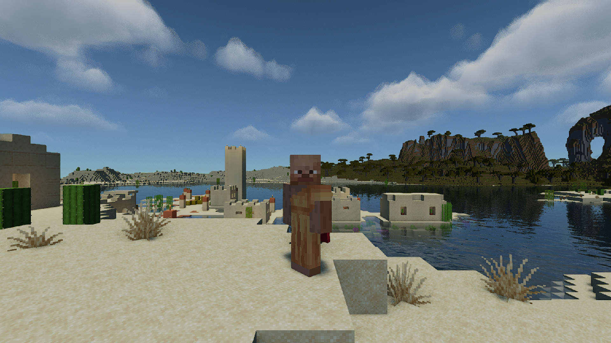

# Overworld flight v1

The standard challenge is one 420-tick creative flight with a smooth north-to-west turn. Minecraft 26.3 and Minescript 5/Pyjinn are required. The [packaged workload](../../silicon_shader/workloads/overworld-v1.json), also printed by `silicon-shader challenge workload`, defines the seed, poses and tolerances.

## Prepare once

Use an isolated instance. Create a disposable **Silicon Shader Overworld v1** world: default Overworld, seed **20260929**, creative, commands enabled, structures on, bonus chest off. Do not use a personal world or world-generation mods. Generate the corridor before timing: at render distance 32, visit the start `-121.3 100 438.7`, midpoint `-121.3 100 346.2` and end `-233.3 100 320.7`, allowing terrain to finish loading. Restore the profile's render distance afterward. First-time downloads and world preparation are separate from the repeat benchmark budget.

Use the existing [FrameAgent source and build script](../../recipes/m4-wide24/sampler/), following the sampler setup in the [working recipe](../../recipes/m4-wide24/README.md). This is the 26.3 adapter; the generic sampler has a different completion format. Set `MCBENCH_EVIDENCE` to the same output directory passed to FrameAgent when launching the instance. The default is `minescript/bench-output` if both tools use it. Keep the sampler's inactivity policy at MINIMIZED.

Copy `reference_flight.pyj` into the instance's `minescript/` directory. Keep the game focused, with debug charts closed. The agent can invoke the script through its existing game harness; it must not steer during capture.

## Run

From Minecraft chat, invoke:

```text
\reference_flight
```

An optional unique run ID and phase may follow the command: `\reference_flight baseline-001 baseline` or `\reference_flight candidate-001 candidate`. The phase is `baseline`, `candidate` or `profile`. The runner checks the named world and actual generation settings, sets FOV 70/effects 0 and frozen clear noon, enables native flight if needed, teleports to the start and settles before measurement. It then records 30 seconds of stationary warmup and about 21 seconds of scripted flight. Capture ends after all 420 movement ticks, retaining the next frame so the final slow interval is included. A 30-second safety limit bounds a stalled route. Each attempt has a 75-second deadline and releases movement keys on completion or a caught error.

The runner records actual world settings, terrain probes, camera poses, flight state, focus, dimensions and timing, alongside the real FrameAgent files. It never creates sampler completion evidence. Normalize each finished run:

```sh
silicon-shader challenge route-receipt CONTROL RUN_ID --out route.json
```

Only this validation establishes that the observations match the standard. A script finishing does not establish acceptance. Use one baseline and one candidate; follow the [submission workflow](../../docs/WORKLOAD.md). Aim for under five minutes per repeat comparison. Stop and diagnose instead of starting an automatic retry loop.

## Verified on hardware

A fresh default world on the base M4 produced the pinned terrain probes. Runs `owv1cal8` and `owv1cal9` took 30.045/30.004 seconds of warmup and 20.996/21.004 seconds of flight. All 22 recorded positions and yaw samples matched exactly. The second run exercised automatic preparation. Both sampler completions had no focus loss or sink errors. The final sampler-stop implementation was then exercised in `owv1stop1`: 30.055 seconds of warmup, 21.035 seconds of captured frames, and the closing frame retained after the route ended at 21.025 seconds relative to frame zero. That run passed the CLI route validator; the built sampler matched the shipped sources.

A completed capture reports `recorded`; older receipts may say `calibration_required`. Raw output always needs validation. Frame and route timestamps come from the same JVM clock, with a small allowed startup offset. These are self-reported development observations, not remote anti-cheat proof or a new performance submission. Prepared terrain keeps world generation out of the timed comparison. This short flight does not establish all-day gameplay stability.

## Submission screenshot

After measuring the candidate, take its portrait in the same world. The `showcase` section of `silicon-shader challenge workload` pins the location and camera: player position **-109.5, 70, 438.5**, yaw **0**, pitch **0**, overlooking the village bay. Every new submission uses front-facing third person (the second F5 view), FOV 70, clear noon, a hidden HUD and a **1920×1080** framebuffer. Keep the candidate's shaders, resource packs and visual settings. The player’s own skin is part of the picture.

Copy `showcase.pyj` into the instance’s `minescript/` directory, then let the agent run:

```text
\showcase prepare
```

It selects the front camera explicitly, moves to the fixed spot, sets the viewport and lets exposure settle. Once it reports ready, the agent presses **F2** through its existing game controls to save a normal Minecraft screenshot. This runs outside the render callback so it captures a completed scene. Identify the new PNG created after the ready message in that instance’s `screenshots/` directory; do not reuse an older file. Run `silicon-shader challenge screenshot /path/to/new.png`, then inspect its pixels: the face, backdrop, framing and dimensions must match the reference below. Then run:

```text
\showcase restore
```

This restores the prior pose, FOV, HUD and window settings and returns to first person. The timed flight also explicitly selects and checks first person. The portrait is a separate short step, never part of the frame-time measurement.

Keep the complete image without cropping or retouching. Add `"screenshot_view": "overworld-front-v1"` to the submission presentation only after checking it. The screenshot resolution is standardized separately from the benchmark resolution shown on the card.



The dedicated reference world deliberately stays at clear noon. Restoration covers the player pose, FOV, HUD and window, not that benchmark environment. Never use a personal world for this workflow.
